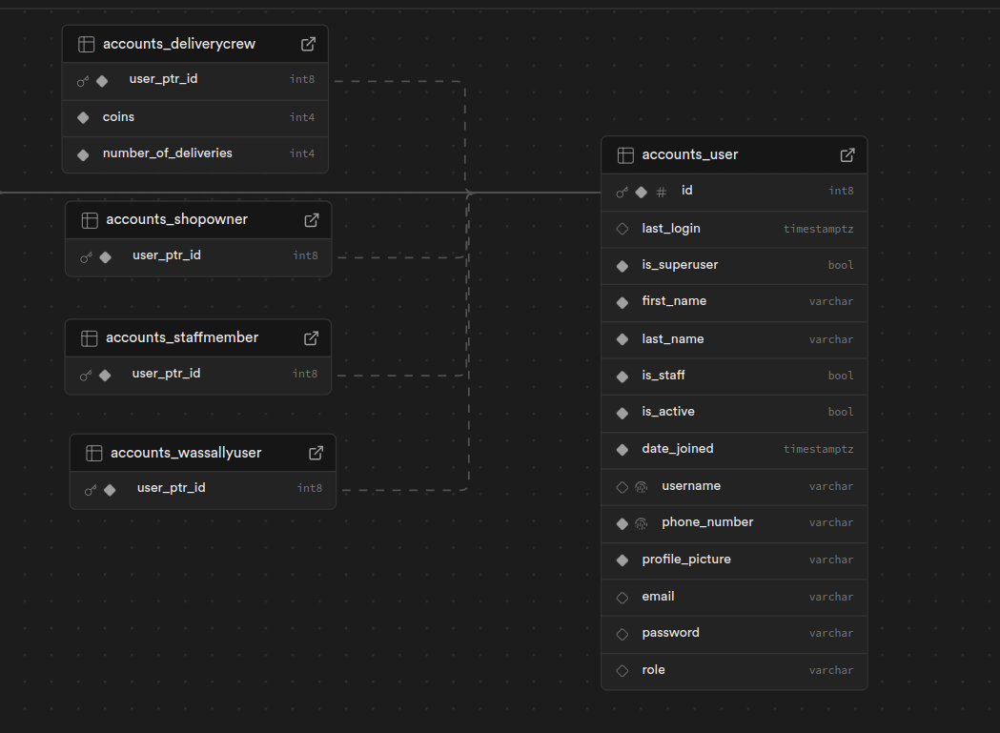
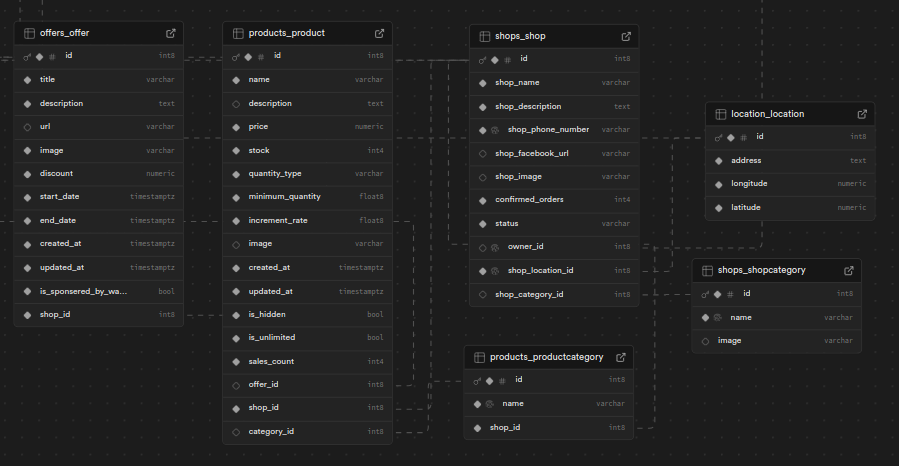
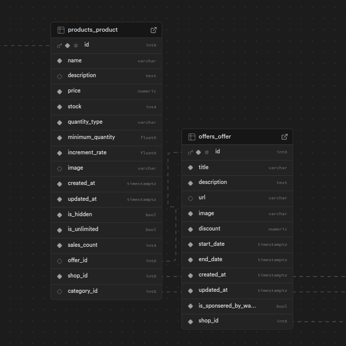
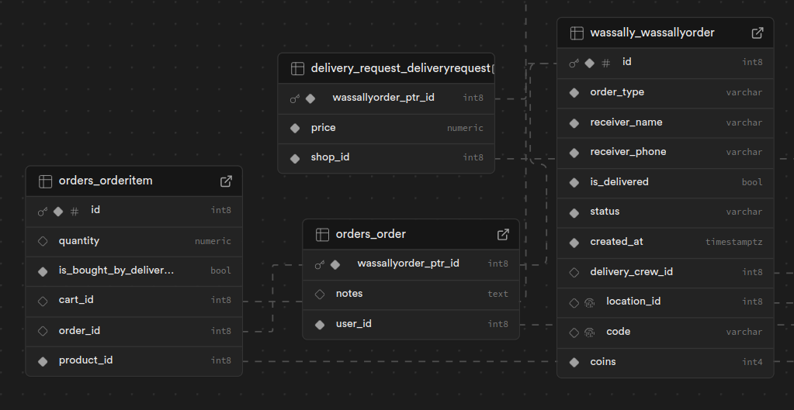

# Wassally-Backend-Architecture

## Introduction

This project is a **multi-platform ecosystem** consisting of **three mobile apps** and a **dashboard** designed to streamline e-commerce operations.  

- **User App**: Allows users to browse shops, add products to a cart (from up to 3 shops), place orders, and track order status (e.g., picked or delivered).  
- **Delivery Crew App**: Enables delivery personnel to view pending orders, pick them up, and mark them as delivered.  
- **Shop Owner App**: Lets shop owners manage products (add/edit/delete), create offers, categorize items, and view sales analytics (e.g., most sold products, monthly/yearly profits) via charts.  
- **Staff Dashboard**: Provides staff members with tools to manage orders, track delivery crews, and register new shops or delivery personnel.  

The system is built to ensure seamless coordination between users, shop owners, delivery crews, and staff, enhancing the overall e-commerce experience.

---
## Documentations

public Doc : https://wassally.onrender.com/api/docs/public/

---

## Technologies

### Backend
- **Framework**: Django REST Framework (DRF)  
- **Database**: PostgreSQL  

### Frontend
- **Mobile Apps**: Flutter  
- **Web Dashboard**: React.js  

---

## Scenarios

### User App
1. **Browsing Products**:  
   - A user opens the app, browses products from multiple shops, and adds items to their cart.  
   - The cart allows products from up to **3 shops** at a time.  

2. **Placing an Order**:  
   - The user places an order and tracks its status (e.g., "Order Placed," "Out for Delivery," "Delivered").  

3. **Tracking Delivery**:  
   - The user receives real-time updates on their order, such as when the delivery crew picks it up and when it’s delivered.  

### Delivery Crew App
1. **Viewing Pending Orders**:  
   - A delivery crew member logs in and views a list of pending orders in their area.  

2. **Picking Up Orders**:  
   - The crew member selects an order to deliver and marks it as "Picked Up."  

3. **Marking Orders as Delivered**:  
   - After delivering the order, the crew member marks it as "Delivered," updating the user’s order status.  

### Shop Owner App
1. **Managing Products**:  
   - A shop owner adds, edits, or deletes products and categorizes them for better organization.  

2. **Creating Offers**:  
   - The owner creates special offers on specific products to attract more customers.  

3. **Viewing Analytics**:  
   - The owner accesses charts and reports to analyze sales performance, such as the most sold products and monthly/yearly profits.  

### Staff Dashboard
1. **Managing Orders**:  
   - A staff member monitors all orders, ensuring smooth coordination between users, shops, and delivery crews.  

2. **Registering New Shops/Crews**:  
   - The staff member registers new shops and delivery crews into the system.  

3. **Tracking Delivery Crews**:  
   - The staff member tracks the status of delivery crews and resolves any issues that arise during delivery.

---

## Database
### Overview
The project uses **PostgreSQL** as the primary database to store and manage data for users, shops, products, orders, and delivery crews. The database is designed to ensure **scalability**, **data integrity**, and **efficient querying**.

### Key Tables
1. **Users Table**: Stores user information (e.g., name, email, password, ..etc).

      

      
2. **Shops Table**: Contains details about shops, including shop name, owner information, and product listings.

      

      
3. **Products Table**: Stores product details (e.g., name, price, category) and links them to specific shops.

      

   
4. **Orders Table**: Tracks orders placed by users, including order status (e.g., pending, delivered) and delivery crew assignments.

      

Integrated with **Supabase**, a PostgreSQL-based DB hosting service, for seamless database management, scalability, and real-time capabilities.  
